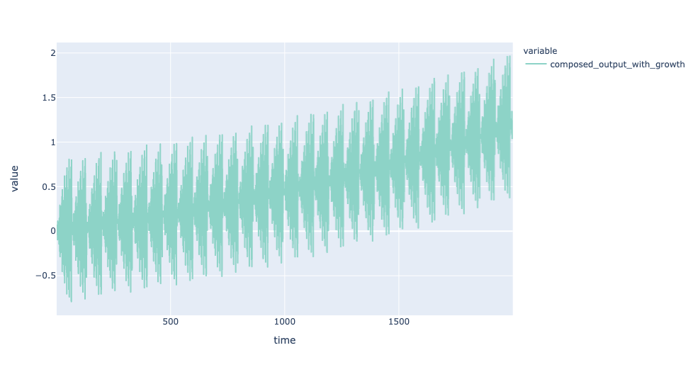
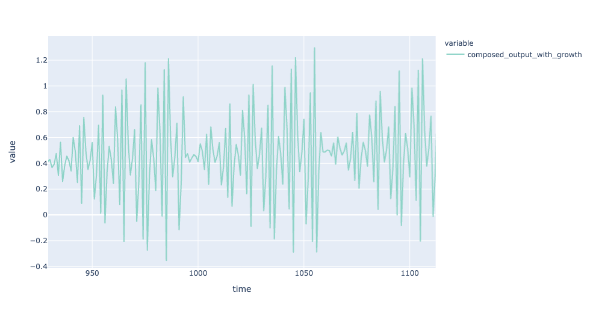
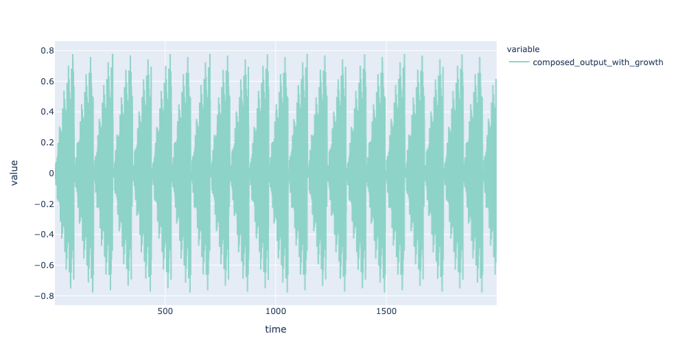
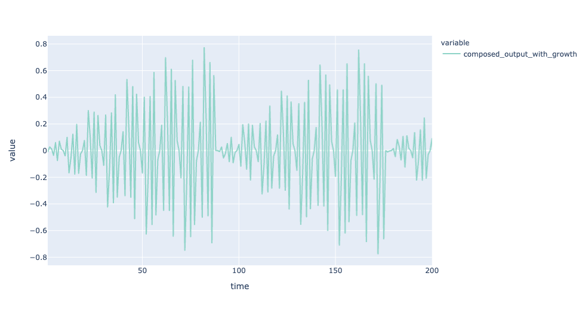
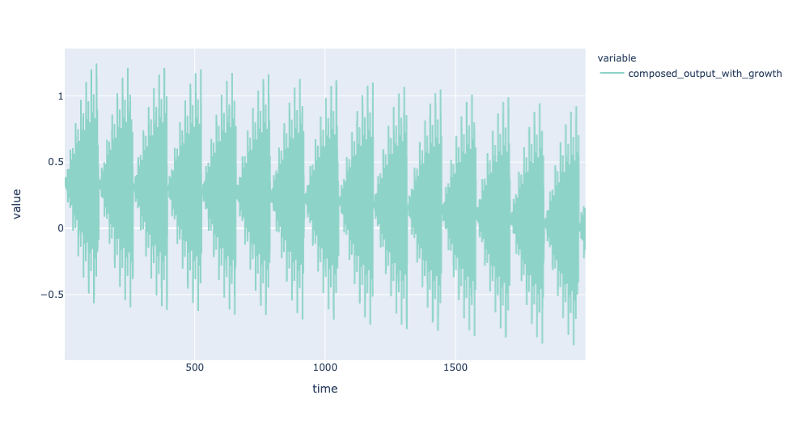
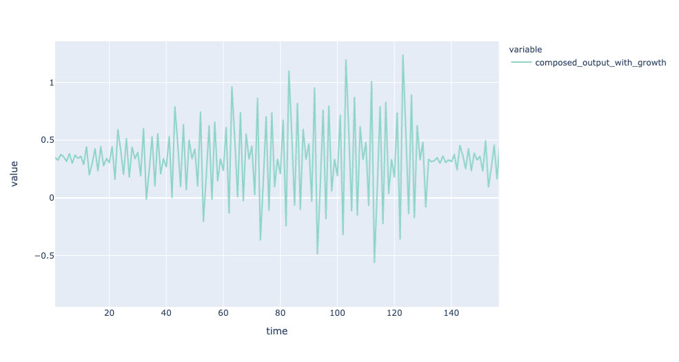
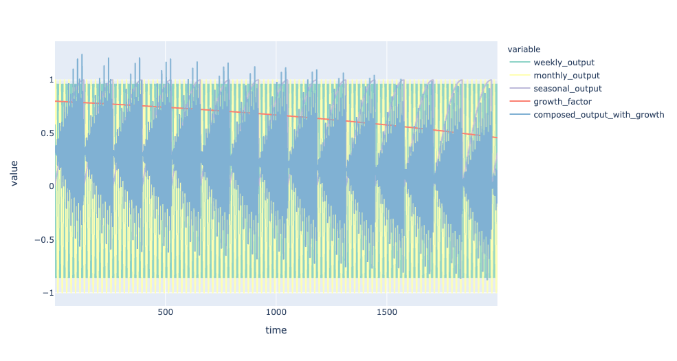

# Introduction 

This is a theoretical exercise to try to model and understand a team of humans working together and pursue a way to describe synergy and serendipity as demonstrable factor.

This is not expect to be novelty, it mostly a compilation of ideas in a pursue to clarify some interesting ideas.  

# What is a team? 

Assumptions: 
 
- A team is a collection of actors in a project. 
- A team can have its output or production measured based on subjective, but quantitative factor(a number on a scale). 
- A actor can be of several types: Productive, Neutral, Noise, Unproductive, and others. 
- A team output is the sum of the outputs of its actors
- Actors are humans and they have their output or production measured based on subjective, but quantitative factor(a number on a scale). 
- Actors have several internal/external rhythms that can influence their outputs values

# Sample of Actors

On the samples we will explore the idea: 
- Positive output: Deliveries or results that add value to a group goals;
- Negative output: Deliveries or results that that do not add value to the group goals and as time is finite, can be saw as "lost chance" of work towards the team goals. 
> As the metric is subjective, the goal is to reflect "Achievements" and "Fails" measures. 

## A Productive Actor: 
- In a low resolution observation, its output grows with time.

Low Res view on a long term picture: 

High Res view on a short-term pictures: 

**Output is not constant, several factors can impact it.** 

Several factors can influence this in realistic terms: 
- Controllable life externalities 
- Self-knowledge of its limits 
- Continuous education
- Dedication to its craft 
- Internal/External motivation

## A Neutral Actor: 

- In a low resolution observation, its output is constant across time. No growth or decay visiable.  

Low Res view on a long term picture: 

High Res view on a short-term pictures: 

Several factors can influence this in realistic terms: 
- Lack of ambition towards growth
- Lack of incentives to produce growth
- Limited engagement with team goals
- Limited visibility with team goals

## A Unproductive Actor: 

- In a low resolution observation, its output decays with time. 

Low Res view on a long term picture: 

High Res view on a short-term pictures: 

Rate of decay(red line):
 

**Output is not constant, several factors can impact it. Even with regular up/downs for humans rhythms(cicles), decay is visible** 

Several factors can influence this in realistic terms: 
- Lack of ambition towards growth
- Lack of incentives to produce growth
- Lack engagement with team goals
- Lack visibility with team goals
- Disconnection with teams goals or updates